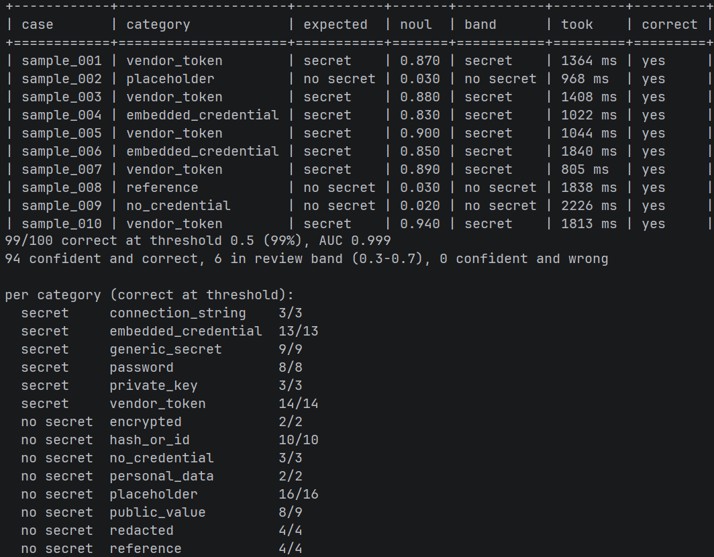

# jev-secret-detection

Measures how well TypeSafe's Jev model spots real secret credentials in file snippets. Each test case is sent to
Jev as a single [Noul](https://docs.typesafe.ai/primitives/noul) question ("does `content` contain a real secret
credential that someone reading it could use?"), and the returned probability is compared with the expected label.

There is deliberately no regex matching or provider verification. The goal is to score Jev itself.



## Usage

```bash
echo "TYPESAFE_API_KEY=..." > .env
uv run python main.py
```

The default run is the 100-case set. Add `edge` or `config` (`uv run python main.py config`) to run one of
the smaller batches instead.

The report shows one row per case (noul, band, round trip, and server time), then:

- accuracy at a 0.5 threshold
- AUC (how well the scores rank secrets above non-secrets, independent of any threshold)
- recall (share of secrets flagged) and precision (share of flagged cases that are secrets)
- mean noul for secrets and for non-secrets, and the Brier score (mean squared gap between noul and label, 0 is
  perfect and 0.25 is what always answering 0.5 gets)
- how many cases fall in the review band (0.3 to 0.7) versus confident right or wrong
- accuracy and mean noul per category
- latency: mean, p50, p95, and max for the round trip and for server time, plus requests per second

### Latency

The round trip is what the client waits for. Server time comes from the `x-envoy-upstream-service-time` response
header (undocumented, so the line disappears if TypeSafe drops it) and leaves out the network. TypeSafe's docs say most
queries complete in about 100 ms, which matches the server p50 of 75 to 90 ms measured here.

The API runs in AWS `us-west-2`, so the network sets the floor on the round trip. From a machine with a 185 ms TCP
round trip to it, a warm request takes about 290 ms at p50, and a request on a new connection takes about 1.2 s
(TCP and TLS setup).

`main.py` sends 16 requests at a time and opens the connections before timing starts. Sending all 100 at once
pushed the round trip p50 to about 2 s (the server time stayed near 90 ms) and triggered `529 Overloaded` retries.
The report counts requests the SDK retried, since their round trip includes the backoff. p99 is left out because with
100 cases it lands between the two slowest requests, which max already shows.

## Files

| File | Purpose |
|---|---|
| `main.py` | Runs the cases (16 at a time) and prints the report |
| `questions.py` | The Noul question and the pinned model (`jev-1.13.0`) |
| `fixtures.py` | The 100 test cases |
| `fixtures_edge.py` | 17 hard placeholder and redacted cases, paired with real secrets |
| `fixtures_config.py` | 20 config-shaped cases: low entropy, no vendor prefix, real config formats |
| `utils.py` | Scoring (bands, AUC, Brier), latency percentiles, and table output |

## Test data

Each case has a `file_path`, the `content` of the snippet, `expected_secret`, and a `category`. Jev receives only
`file_path` and `content`. Case names (`sample_001` and up) are neutral and never sent.

**Labeling rule:** a case is a secret when `content` contains a complete credential value that looks issued or
chosen for real use. The label must be decidable from `content` alone; the path is realistic context, and both
labels appear in docs, example, log, and production files.

The set is split 50/50:

| Secret (50) | Cases | Not a secret (50) | Cases |
|---|---|---|---|
| `vendor_token` (prefixed keys: GitHub, Stripe, Slack, ...) | 14 | `placeholder` (filler, example, or test values) | 16 |
| `embedded_credential` (in code, URLs, headers, logs, CI, k8s) | 13 | `hash_or_id` (SHAs, UUIDs, digests, bcrypt) | 10 |
| `generic_secret` (unprefixed keys named by context) | 9 | `public_value` (public keys, certs, publishable keys) | 9 |
| `password` (configs, connection calls, shell history) | 8 | `redacted` (masked or truncated) | 4 |
| `connection_string` (URIs with embedded passwords) | 3 | `reference` (env vars, secret managers) | 4 |
| `private_key` (EC, ed25519, GCP service account) | 3 | `no_credential` (plain code or config) | 3 |
| | | `encrypted` (SOPS, Ansible Vault) | 2 |
| | | `personal_data` (SSNs, not credentials) | 2 |

Many cases come in pairs that share a value or format but differ in label, for example the same UUID as a
`HEROKU_API_KEY` and as a log correlation ID, or an Algolia admin key next to its search-only key. The comment above
each case explains the label and links its pair.

All secret values are randomly generated (key material with openssl and ssh-keygen) and have never been valid
credentials. Expect secret scanners and GitHub push protection to flag `fixtures.py` anyway.

### Config batch

`fixtures_config.py` (`uv run python main.py config`) holds 20 cases where the value is low entropy, carries no
vendor prefix, and sits in a real config file format. Nothing in the string itself says "credential", so the label
can only be decided by asking whether the value is the right kind of value for the field it is written into:
`password Mailer-Relay-7719` in an msmtp account block is a working mail password, while
`passwordeval "pass show smtp/brightmoor/alerts"` in the same slot is a command that fetches one.

This is the class that prefix and entropy rules cannot reach, and the class the other two batches under-represent.
Both of those are built from formats that pattern rules already target, so a scanner looks strong on them by
construction. An ops-chosen password like `Depot-Forklift-5518` scores like a product name.

11 cases are secrets: an msmtp relay password, an LDAP `bindpw`, a plaintext pgbouncer userlist, a Spring
`spring.datasource.password`, a strongSwan PSK, a CIFS password inside fstab mount options, an SNMP read community
string, a Kafka SASL password inside the one-line JAAS string, a Grafana `admin_password`, a Wi-Fi `psk`, and an
`ansible_become_pass` in committed group_vars.

9 are the config-shaped false positives: apr1 and bcrypt hashes in an `.htpasswd`, a SCRAM verifier and a
pgbouncer md5 hash in the same userlist that held the plaintext, pointers to a credentials file and to a password
manager, `bindpw CHANGE_ME_BEFORE_DEPLOY`, Java's documented `changeit` truststore default, a gateway section
where every field name says `api_key` but the values are a header name and a length rule, and test seed users with
`hunter2` and `correct horse battery staple`. Most cases are pairs that share a file and a field and differ only
in the value.

All passwords were invented for this file and have never been valid. The hashes are genuine apr1, bcrypt, SCRAM,
and pgbouncer md5 digests of invented passwords, so they have the right structure without protecting anything.

**What it showed** (two runs, `jev-1.13.0`): 15/20 and 16/20 correct at a 0.5 threshold, AUC 0.939 and 0.955,
against 99/100 on the main set and 16/17 on the edge batch in the same session, which is the gap the batch was
built to find.
All 8 config-shaped passwords were caught, at a mean noul of 0.88, so the class regex walks past is not where Jev
struggles. Every miss but one was a non-secret pushed up into the review band: the SCRAM verifier (0.66, 0.73),
the `.htpasswd` hashes (0.54, 0.53), `changeit` (0.50, 0.52), and the stock test passwords (0.59, 0.59). The one
missed secret was the SNMP community string (0.45, 0.41), the only case where no field name mentions a credential
at all.

### Sources

20 cases (marked "Originally sample_x") come from the first 23-case set, which was built from these sources:

- [gitleaks](https://github.com/gitleaks/gitleaks): token formats from its detection rules (GitHub, Slack), the
  `cafebabe:deadbeef` string from a rule's regex self-test, and the SSN values from its README allowlist example
- [GitGuardian generic high entropy secret detector docs](https://docs.gitguardian.com/secrets-detection/secrets-detection-engine/detectors/generics/generic_high_entropy_secret):
  the low-entropy and non-sensitive-name examples
- [Decryption Digest: secrets scanning in pre-commit and CI](https://www.decryptiondigest.com/blog/secrets-scanning-pre-commit-ci-enforcement):
  the `EXAMPLE_API_KEY` and `test_token_` allowlist placeholders, and the provider list (GCP, Twilio)
- [Cremit: secret scanning false positives](https://www.cremit.io/blog/secret-scanning-false-positives-causes-and-fixes):
  the false positive categories (AWS documentation keys, commit SHAs, UUIDs, base64 images, lockfile hashes)

The rest were written for this project. Formats follow each provider's public token format, and the placeholders use
common conventions such as AWS's documentation key pair and jwt.io's default `your-256-bit-secret`.

The config batch was not copied from a dataset, since the published ones carry real leaked values, but its shape
follows what the research on those datasets reports:

- [SecretBench](https://github.com/setu1421/SecretBench)
  ([paper](https://arxiv.org/abs/2303.06729)): 97,479 candidates from 818 public GitHub repositories, labeled by
  hand. It was built by running TruffleHog and Gitleaks over those repositories, and of its 15,084 true secrets
  only 150 are passwords and 27 are usernames, which describes what those tools surface more than what leaks. Its
  per-candidate `entropy`, `has_words`, and `is_template` columns are the axes this batch deliberately holds fixed.
- [A Comparative Study of Software Secrets Reporting by Secret Detection
  Tools](https://arxiv.org/abs/2307.00714): nine tools against a benchmark. It traces false positives to
  "employing generic regular expressions and ineffective entropy calculation", and false negatives to "faulty
  regular expressions, skipping specific file types, and insufficient rulesets".
- [AssetHarvester](https://arxiv.org/abs/2403.19072): pairs each secret with the asset it opens, on the argument
  that the value alone does not tell you whether a finding matters. The config cases keep the asset in the snippet
  for the same reason, so the database URL sits next to the password and the tunnel endpoints next to the PSK.

The config file formats follow their own upstream documentation (msmtp, nslcd, pgbouncer, Spring Boot,
strongSwan, net-snmp, Kafka, Grafana, wpa_supplicant, Ansible), and `changeit`, `hunter2`, `letmein`, and
`correct horse battery staple` are used as the well-known non-secrets they are.
